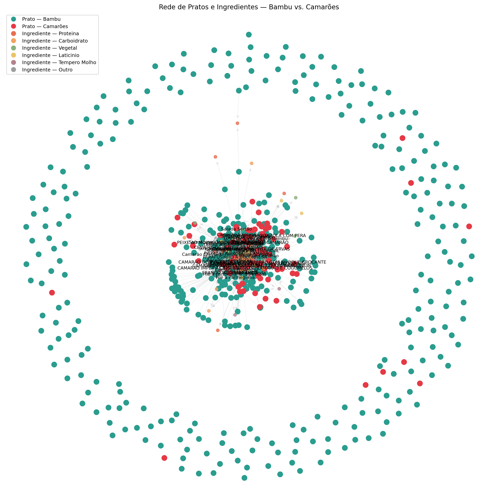
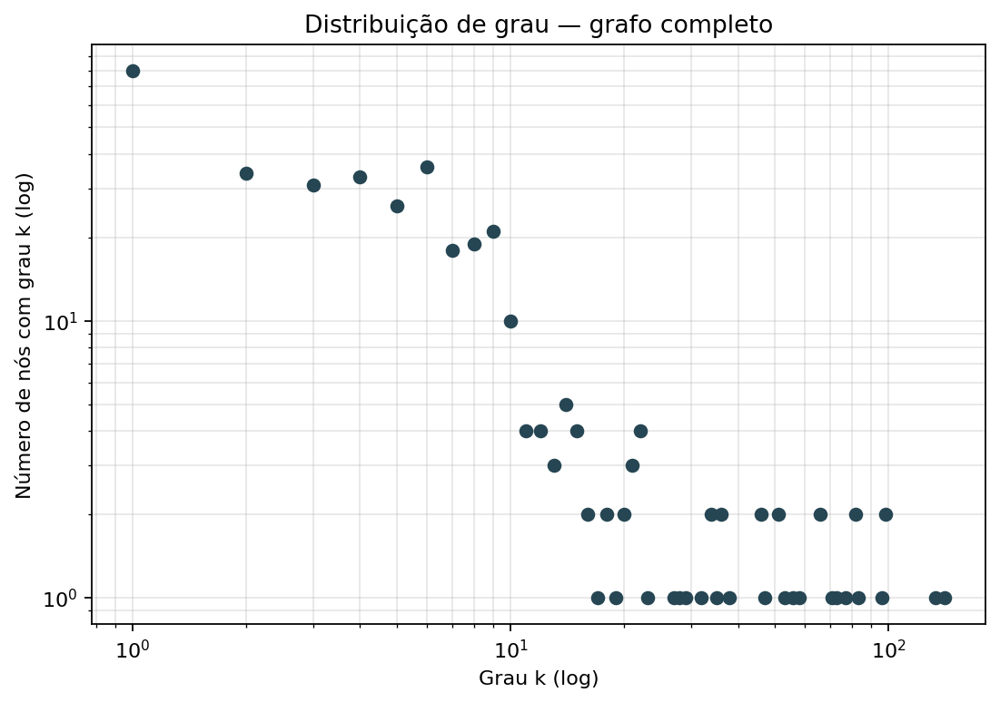
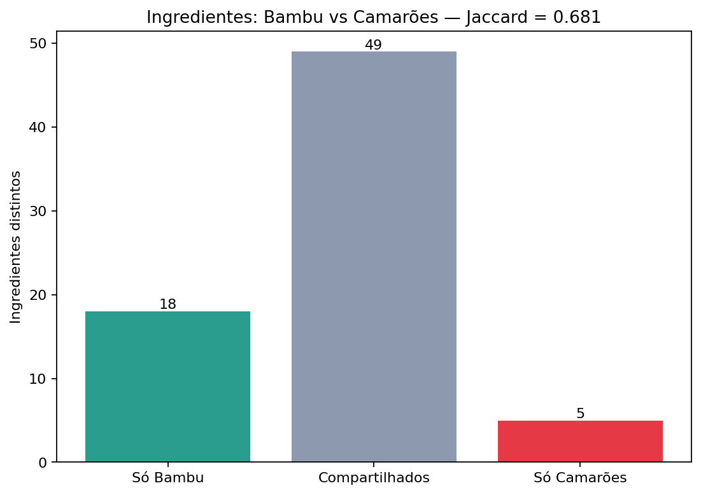
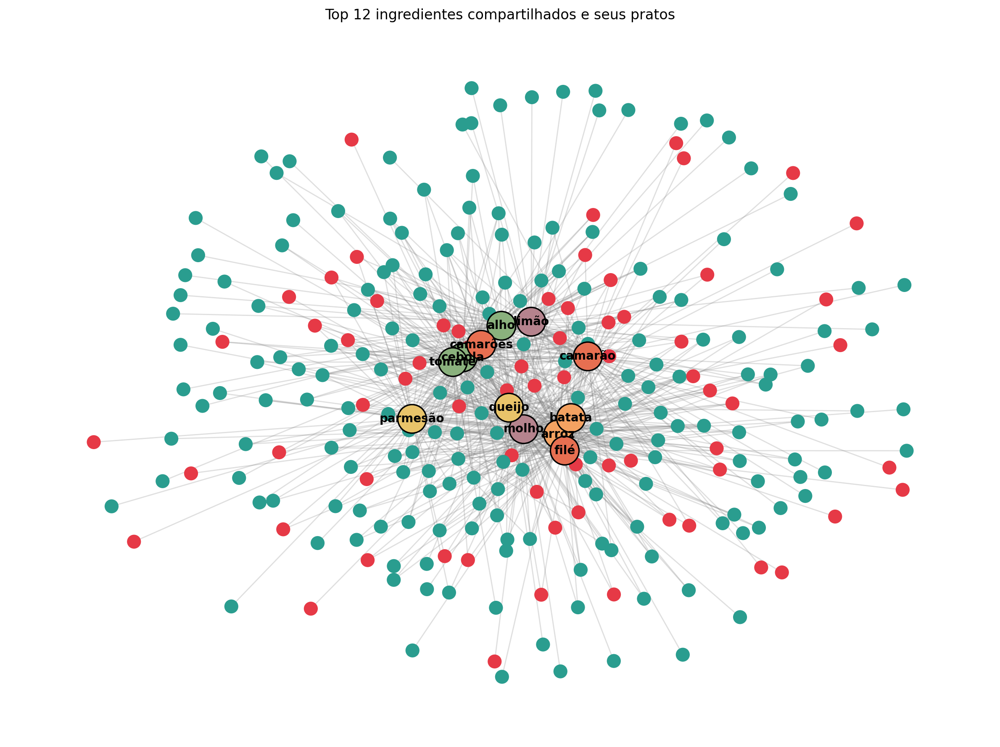
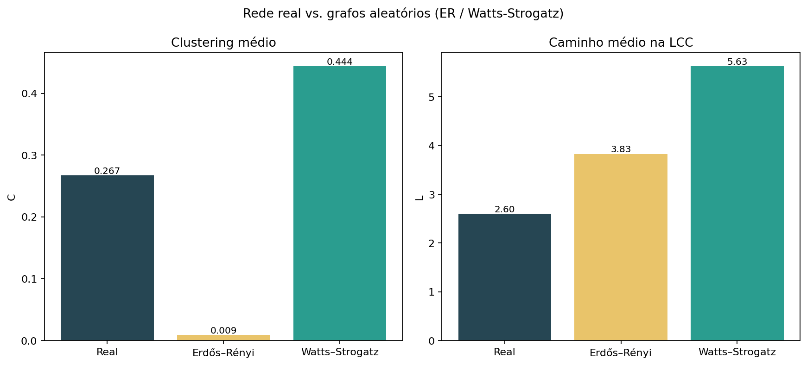

# Restaurant Graph — Análise comparativa de cardápios com NLP e Teoria dos Grafos

Projeto acadêmico que responde à pergunta: **como usar NLP e modelos de linguagem
para extrair grafos a partir de texto não-estruturado, e o que esses grafos
revelam sobre o domínio?** Como caso de estudo, comparamos os cardápios do
**Coco Bambu** e do **Restaurante Camarões** construindo, para cada prato, uma
rede bipartida Prato ↔ Ingrediente e analisando sua estrutura com NetworkX.

## Integrantes do grupo

- *João Pedro Araújo Ramalho*
- *Kiev Luiz Freitas Guedes*
- *Maria Eduarda Silva da Costa*

## Vídeo de apresentação

[Assistir no Loom](https://www.loom.com/share/5bfce96f186a4ae5ac158dda93bb163a)

[Apresentação Canva](https://canva.link/sc4f2m44dba8q7o)

---

## Sobre o projeto

Um cardápio é um texto semi-estruturado: cada prato tem nome, preço e uma
**descrição em linguagem natural** com os ingredientes. A pergunta estrutural
é — *o que os ingredientes, considerados como rede, dizem sobre a identidade
de cada restaurante?*

Para responder, aplicamos:

1. **Scraping** para obter o cardápio bruto (HTML do Coco Bambu e PDF do Camarões).
2. **NER com spaCy** (modelo `pt_core_news_lg`) usando `EntityRuler` sobre uma
   taxonomia de ingredientes, para extrair menções e relações culinárias
   (`RECHEADO_COM`, `ACOMPANHADO_DE`, `AO_MOLHO_DE`) das descrições.
3. **Construção de um `MultiDiGraph` bipartido** em NetworkX: nós de tipo
   *Prato* (coloridos pelo restaurante) e nós de tipo *Ingrediente* (coloridos
   pela categoria), conectados por arestas rotuladas com a relação inferida.
4. **Análise estrutural** — densidade, grau, componentes, diâmetro, caminho
   médio, clustering, transitividade — e análise avançada — betweenness,
   closeness, eigenvector, PageRank, comparação com grafos aleatórios (ER e WS).
5. **Visualização** estática (matplotlib), interativa (pyvis) e um dashboard
   HTML único que agrega todos os artefatos.

## Como rodar

Pré-requisitos: `uv`, Python ≥ 3.12. Todo o resto (incluindo o modelo do
spaCy) é instalado automaticamente pelo `uv sync`.

```bash
uv sync
uv run python main.py
```

O primeiro `main.py` roda os scrapers automaticamente se os JSONs não
existirem. Os artefatos ficam em `outputs/`:

```
outputs/
├── index.html                # dashboard consolidado — abra no navegador
├── restaurant_graph.gexf     # grafo completo (abrir no Gephi)
├── graph_static.png          # visão geral em matplotlib
├── graph_interactive.html    # grafo navegável (pyvis)
└── analysis/
    ├── metrics.txt           # relatório textual completo
    ├── degree_distribution.png
    ├── ingredient_comparison.png
    ├── shared_ingredients_network.png
    └── random_comparison.png
```

Para **apenas** regenerar os JSONs de entrada (sem refazer grafo/análise):

```bash
uv run python -m scrapers
```

## Resultados principais

### Panorama numérico

| Métrica            | Geral | Coco Bambu | Camarões |
|--------------------|------:|-----------:|---------:|
| Pratos             |   303 |        230 |       73 |
| Ingredientes       |    71 |         66 |       53 |
| Densidade          | 0.027 |      0.032 |  **0.107** |
| Grau médio         |  9.94 |       9.41 |  **13.33** |
| Diâmetro (LCC)     |     7 |          7 |        5 |
| Caminho médio (LCC)|  2.58 |       2.61 |     2.17 |
| Clustering médio   | 0.458 |      0.435 |  **0.533** |
| Transitividade     | 0.175 |      0.206 |    0.352 |

Jaccard de ingredientes (Bambu ∩ Camarões): **0.676**.

### Rede completa



Pratos coloridos pelo restaurante, ingredientes pela categoria da taxonomia.
Fica visível a bipartição e a dominância visual de poucos ingredientes-hub.

### Distribuição de grau



A cauda pesada é a assinatura de redes reais — poucos ingredientes concentram
a maior parte das arestas.

### Sobreposição de ingredientes



Dos 71 ingredientes totais, **48 (67.6%)** aparecem nos dois restaurantes. Só
5 são exclusivos do Camarões (`gorgonzola, jerimum, milho, orégano,
provolone`), contra 18 exclusivos do Bambu.

### Travessia Bambu ↔ Camarões pelos top-12 compartilhados



### Rede real vs grafos aleatórios



| Modelo           | Clustering | Caminho médio | Parâmetros               |
|------------------|-----------:|--------------:|--------------------------|
| **Real**         |   **0.458**|     **2.584** | n=374, k≈9.94            |
| Erdős–Rényi      |      0.026 |         2.825 | n=374, p=0.0266          |
| Watts–Strogatz   |      0.490 |         3.692 | n=374, k=10, p_rewire=0.1 |

## Análise e conclusões

- **Mesmo vocabulário, gramáticas diferentes.** Jaccard de ~0.68 diz que os
  dois restaurantes não se distinguem pelos ingredientes que usam, mas pela
  frequência com que os combinam.
- **Camarões é uma rede especialista.** Densidade ~3.5× maior, clustering
  maior e diâmetro menor — uma identidade temática que aparece
  diretamente na topologia, centrada no hub `camarão` (81 arestas).
- **Coco Bambu é uma rede generalista.** Muito maior em nós absolutos,
  porém mais esparsa, com pratos cobrindo várias cozinhas e menos
  interconectados via ingredientes comuns.
- **A rede é *small-world* real, não aleatória.** Clustering ~17× acima do
  ER mostra estrutura genuína; o caminho médio curtíssimo (2.58, menor
  inclusive que o WS) sugere comportamento *scale-free* por conta dos hubs
  (`camarão`, `molho`, `arroz`).
- **Centralidades além do grau revelam pontes ocultas.** `limão` tem só
  o 10º maior grau, mas a **2ª maior betweenness global** (e a maior no Bambu) — é
  um ingrediente ponte que conecta partes distantes do cardápio.

A análise completa (com tabelas, interpretação e considerações
metodológicas) está em [`docs/analise.md`](docs/analise.md). Para uma visão
consolidada navegável, abra [`outputs/index.html`](outputs/index.html) após
rodar o pipeline.

## Estrutura do projeto

```
restaurant_graph/
├── main.py                # orquestra todo o pipeline
├── scrapers/              # HTML → JSON (Bambu) e PDF → JSON (Camarões)
├── graph/                 # NER, taxonomia, construção e análise do grafo
│   ├── ingredients.py     # taxonomia + keywords de relação
│   ├── ner.py             # EntityRuler + classificação de menções
│   ├── builder.py         # build_graph(sources) → MultiDiGraph
│   └── analysis.py        # métricas, centralidades, random baselines
├── viz/                   # camada de visualização
│   ├── static.py          # matplotlib
│   ├── interactive.py     # pyvis
│   ├── analysis.py        # distribuição de grau, comparações
│   └── dashboard.py       # index.html consolidado
├── data/                  # fontes brutas (bambu.txt, camaroes.pdf)
├── json_graphs/           # JSONs intermediários dos cardápios
├── docs/                  # README complementar e imagens
└── outputs/               # artefatos gerados (gitignored)
```

## Stack técnica

- **Python 3.12+** com `from __future__ import annotations`
- **NetworkX** para grafos e métricas
- **spaCy + pt_core_news_lg** para NER
- **BeautifulSoup4** / **pdfplumber** para scraping
- **matplotlib** / **pyvis** para visualização
- **uv** para dependências, **ruff** para lint/format

## Alinhamento com a disciplina

- **Fundamentos I e II:** densidade, grau, componentes, diâmetro, caminho
  médio, clustering, transitividade (todos em `metrics.txt`).
- **Mundos Pequenos:** comparação com Erdős-Rényi e Watts-Strogatz para
  validar a hipótese de small-world.
- **Estudos de caso com NetworkX:** pipeline completo NER → grafo →
  métricas → visualização, com saída em GEXF para integração com Gephi.

Centralidades avançadas (betweenness, closeness, eigenvector, PageRank)
estendem a análise além do conteúdo programático.

## Responsáveis

- ETL dos dados e construção do grafo: Maria Eduarda
- Visualização e Análise: João Pedro e Kiev Luiz
